# ML Service — Problems, Solutions & How It Works

> **What this document is:** a study guide for `app/ml_services`. For every
> subsystem it answers four questions: *What problem are we solving? → How are
> we solving it? → How does it work, step by step? → Where is the code?*
> Diagrams are [Mermaid](https://mermaid.js.org) — they render on GitHub, or
> paste them into mermaid.live while studying.

---

## 0. The big picture

### The problem

Customer feedback arrives as a raw, messy, high-volume, mixed-intent stream:

- complaints, phishing attempts, and transactional notices in **one inbox**
- free text full of typos, whitespace noise, and unicode junk
- no labels for urgency, resolution state, security risk, or emotion
- thousands of messages per day — far beyond manual triage capacity
- and an LLM that is *helpful but not guaranteed* (rate limits, downtime,
  cost, key expiry)

**The goal:** turn every raw message into a *complete, machine-actionable
intelligence record* — category, intent, sentiment, emotion, urgency,
resolution status, summary, security risk, and a recommended action —
**deterministically, observably, and without ever going dark**.

### The solution in one sentence

A **hybrid AI architecture**: one structured Gemini LLM call for deep
understanding, wrapped in deterministic fallback layers (scikit-learn
models, regex detectors, rule engines) so every request always produces a
valid, warning-annotated answer.

### The full request flow

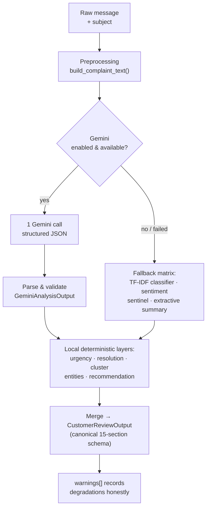

**Files:** `orchestration/pipeline.py`, `api/routes.py`, `main.py`

---

## 1. Preprocessing — "garbage in" must become "signal in"

### Problem

Raw text carries control characters, collapsed whitespace, unicode
look-alikes, and nulls. Feeding that into TF-IDF or an LLM corrupts both
statistics and prompts, and evaluation data can leak between train and test.

### How we solve it

A single canonical cleaning module that *everything* imports — ML models,
summarizer, urgency detector, tests, and the data layer.

### How it works

1. `normalize_text()` — NFKC-normalize unicode → strip control chars
   (`\x00–\x1f`, `\x7f`) → collapse whitespace → strip.
2. `build_complaint_text()` — safely combine subject + message (subject only,
   **never** the target `issue` column → no label leakage), capped at 10,000
   chars.
3. `clean_csv_data()` — fill NaNs with channel/domain defaults, normalize all
   string columns, **deduplicate** on (message, subject, intent, issue).

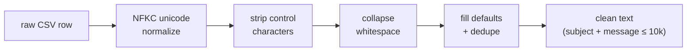

**Why it matters:** one cleaning definition = zero train/serve skew. The QA
test suite (`tests/qa/test_qa_data_pipeline_and_leakage.py`) asserts that
the target variable never leaks into features.

**Files:** `preprocessing/cleaner.py`, `preprocessing/dataset.py`

---

## 2. Classification — what is this feedback about?

### Problem

Support and security teams route tickets by topic. With 11 categories
(login problems, payment issues, delivery, security concerns…) and no
labels on new messages, routing must be automated — and must *know when it
doesn't know*.

### How we solve it

TF-IDF (word 1–2 grams) → Logistic Regression, trained offline
(`scripts/train_classifier.py`), persisted with joblib, served through a
**confidence threshold with abstention**.

### How it works

1. Text → TF-IDF vectors (fit *inside* the saved pipeline → consistent
   tokenization at serve time).
2. Logistic Regression → probability per category.
3. If `max_prob < 0.60` → **abstain**: category = OTHER,
   `needs_review = True`, warning recorded.

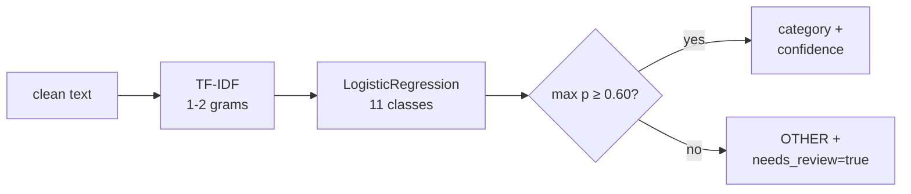

**Design point — abstention:** a wrong confident answer is worse than a
flagged uncertain one. Low-confidence messages are surfaced to humans
instead of silently mis-routed.

**Honest limitation:** the baseline model's macro-F1 is low (0.10) because
11 classes on a small subset is hard; the LLM path does the heavy lifting in
production and the local model is the safety net.

**Files:** `classification/classifier.py`, `scripts/train_classifier.py`,
`config/model_registry.yaml` (metrics + lineage)

---

## 3. Clustering — discovering issues nobody labeled

### Problem

Categories answer *"what kind of problem?"* but not *"are 4,878 people
reporting the same new thing?"* Emergent issues don't fit preset labels.

### How we solve it

Unsupervised MiniBatchKMeans (k=15) over TF-IDF vectors, trained offline and
shipped with cluster metadata (names, sizes, exemplars).

### How it works

1. Vectorize text with the same TF-IDF scheme.
2. Assign to the nearest of 15 centroids → `cluster_id` +
   `similarity_score` (distance to centroid).
3. Look up human-readable `cluster_name` from `clusters_metadata.json`.
4. `/api/v1/clusters` exposes all clusters for drill-down.

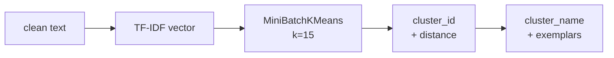

**Design point:** clustering runs **fully offline-deterministic** — no LLM
needed, so volume discovery works even in fallback mode.

**Files:** `clustering/clusterer.py`, `scripts/train_clusterer.py`,
`analytics/frequency.py` (counts issues per cluster/intent)

---

## 4. Sentiment & emotion — how does the customer feel?

### Problem

Negative % drives staffing and escalation policy; emotion (frustration vs
anxiety vs satisfaction) drives tone of the reply. Raw scores aren't enough —
the *provenance* of the score matters.

### How we solve it

Sentiment rides the **single Gemini structured call** (label + score +
reason), with an explicit, never-silent fallback.

### How it works

1. Gemini returns `sentiment_label ∈ {POSITIVE, NEUTRAL, NEGATIVE}` + score.
2. `SentimentAnalyzer.from_gemini_output()` validates + clamps score to [0,1].
3. If the provider failed: `SentimentResult(available=False, provider="fallback")`
   — **clearly marked**, never presented as real analysis.

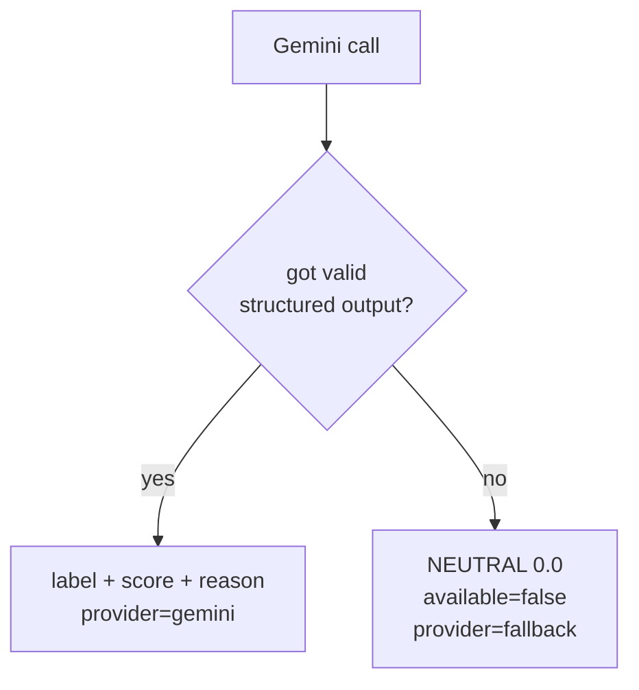

**Lesson learned (documented in the code):** this fallback previously
*looked* like real output in dashboards. The `available=False` flag exists so
consumers can distinguish "measured neutral" from "AI unavailable." The
Backend/ML contract surfaces `provider` and `warnings` for exactly this.

**Files:** `sentiment/analyzer.py`, `ai/gemini_provider.py`

---

## 5. Urgency — which tickets must be touched first?

### Problem

Anger ≠ urgency. A furious customer asking "where is my order?" is medium;
a calm note saying "unauthorized transaction on my card" is critical.
Keyword-matching on sentiment words mis-sorts queues.

### How we solve it

A tiered regex detector over **objective operational risk indicators**,
deliberately separated from sentiment.

### How it works

1. Three compiled pattern tiers:
   - **CRITICAL**: unauthorized, stolen, hacked, phishing, malware,
     ransomware, lawsuit, fraud, outage, card theft
   - **HIGH**: deadlines/ASAP, account lockout/OTP, overdue, missing refund,
     monetary deduction, double charge, escalation requests
   - **MEDIUM**: delays, pending, tracking, wrong item, damaged, returns
2. First tier that matches wins → `UrgencyLevel` + scored evidence
   (`reasons[]`, `score`).
3. No match → LOW.

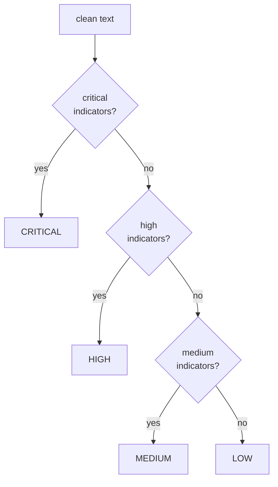

**Design point:** zero-dependency and auditable — you can point at the exact
regex that fired (`reasons[]` names each indicator). Data team can tune tiers
without touching ML models.

**Files:** `urgency/detector.py`

---

## 6. Resolution detection — is this solved?

### Problem

Queues hide already-resolved tickets; unresolved ones age silently. Support
KPIs need per-message resolution state without waiting for an agent to click
"close."

### How we solve it

Pattern-based state machine over three evidence classes.

### How it works

1. `RESOLVED_PATTERNS` — "issue has been fixed", "refund processed"…
2. `UNRESOLVED_PATTERNS` — "still not working", "have not received"…
3. `PARTIAL` signals — agent actions taken but customer outcome unconfirmed.
4. Priority: partial → resolved → unresolved; default UNKNOWN.

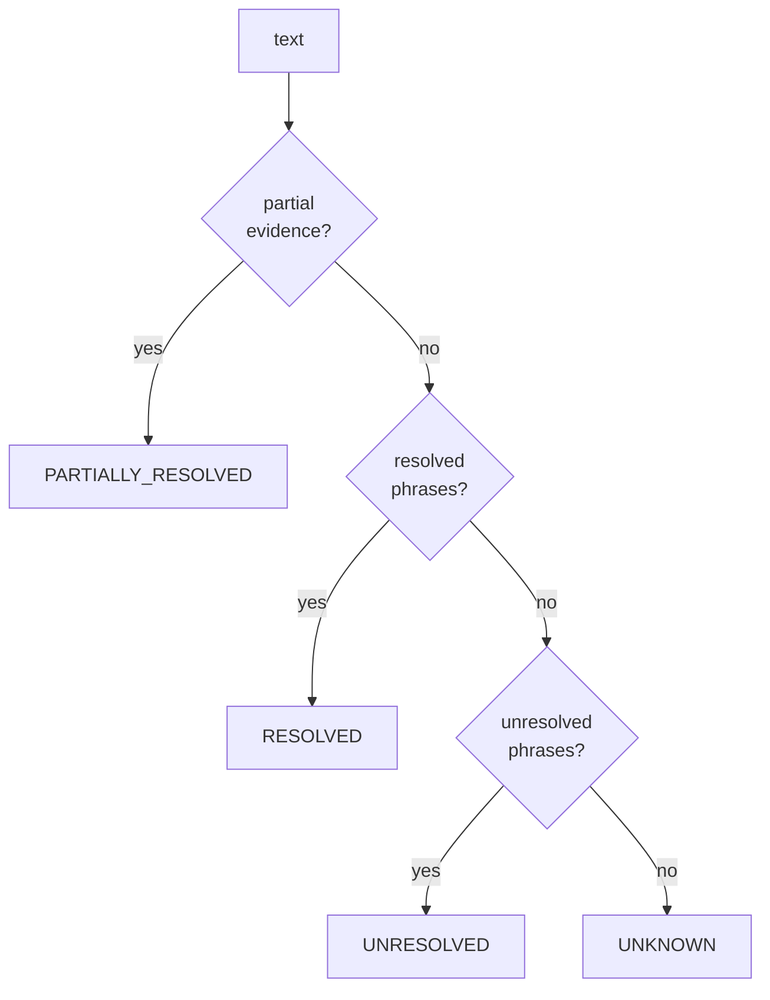

**Files:** `resolution/detector.py` (also feeds the summarizer's status block)

---

## 7. Summarization — the 10-second read

### Problem

Agents and dashboards need a one-glance digest: issue, request, status,
entities — not a wall of text.

### How we solve it

Dual-mode: **LLM abstractive** summary when Gemini is available, **extractive
fallback** (lead + status synthesis) when not.

### How it works

1. Clean text → extract entities with regexes: order IDs (`ORD-99881`),
   amounts (`₹/$/€ + digits`), dates, OTPs.
2. Issue summary = subject + lead sentence (lead sentence carries the ask).
3. If Gemini ran: use its summary + parsed entities. Otherwise the
   extractive version is used and `summary_mode` says which path ran.

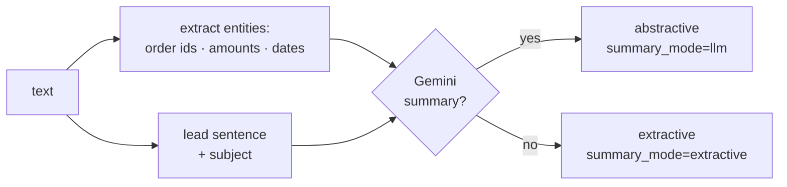

**Files:** `summarization/summarizer.py`

---

## 8. Security — phishing, URLs, emails

### Problem

The same inbox carries credential-harvesting and scam messages. Every message
must be scanned for weaponized URLs and spoofed sender identities.

### How we solve it

Two deterministic analyzers (URL, email) + Gemini social-engineering
detection, fused into one risk verdict.

### How it works — URL analyzer

1. Extract URLs with a robust regex (strip trailing punctuation).
2. Score each: **shortener** domains (penalty 0.40, min risk MEDIUM),
   **IP-literal hosts**, **missing HTTPS**, risky **TLDs** (`.tk`, `.zip`…),
   lookalike/suspicious patterns, credential-path keywords (`/login`,
   `/verify`).
3. Emit per-URL `URLAnalysis` with risk level + reasons.

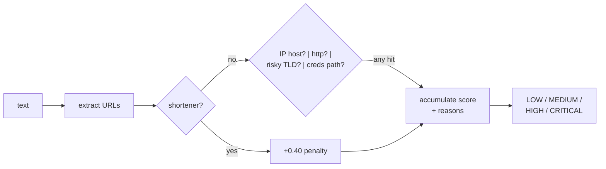

### How it works — email analyzer

1. Extract emails; split local-part / domain.
2. Flags: **free-provider** list, **disposable** domains, **digits in
   domain**, display-name vs domain mismatch (spoofing), typosquat distance
   from known brands.
3. Emit per-email `EmailAnalysis`.

### Fusion

Gemini's social-engineering verdict (technique taxonomy: URGENCY, OTP_REQUEST,
AUTHORITY_IMPERSONATION…) is merged with the deterministic analyzers; the
combined result feeds the recommendation engine.

**Files:** `security/url_analyzer.py`, `security/email_analyzer.py`,
`api/routes.py` (`/api/v1/url/analyze`, `/api/v1/email/analyze`)

---

## 9. Recommendation engine — from signals to action

### Problem

Analytics are useless unless they *do* something. Teams need a consistent,
defensible next action per ticket — not an ad-hoc guess.

### How we solve it

A **declarative rule table** (`config/action_rules.yaml`), evaluated in
priority order — no code change needed to adjust policy.

### How it works

1. Load rules; sort by ascending `priority` (lower = wins).
2. For each rule check conditions against signals:
   `security_risk`, `category`, `urgency`, `resolution`.
3. First rule whose conditions all match → `primary_action` +
   `secondary_actions[]` + human-readable `rationale`.
4. Default fallback action if nothing matches.

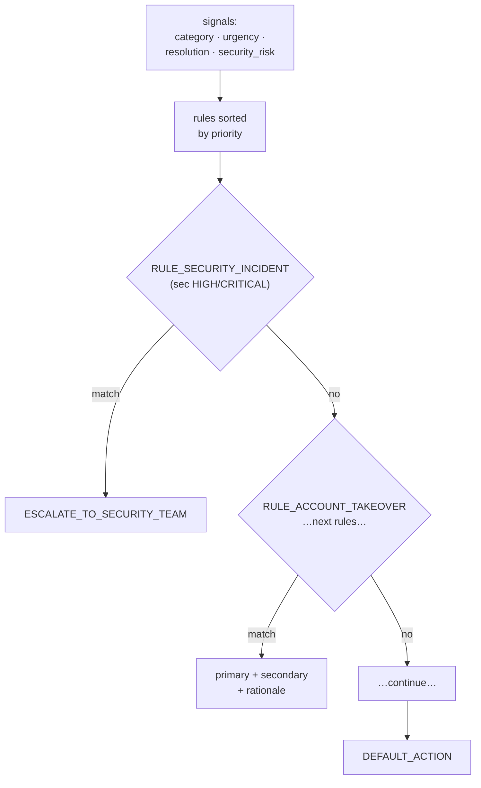

**Example:** security risk HIGH → `ESCALATE_TO_SECURITY_TEAM`, secondary
`RESET_ACCOUNT_ACCESS`, `VERIFY_CUSTOMER_IDENTITY`.

**Files:** `recommendation/engine.py`, `config/action_rules.yaml`

---

## 10. Gemini provider — one call, structured, survivable

### Problem

Calling an LLM per message brings four failure modes: **downtime, rate
limits, malformed output, and slow responses** — plus prompt-injection risk
from user text.

### How we solve it

A provider wrapper with: single structured call, retry/backoff, typed error
translation, strict output validation, and thread-safe timeouts.

### How it works

1. `genai.Client` created once at startup with an **httpx-level timeout**
   (the authoritative deadline — signal-based timeouts don't work in
   uvicorn's worker threads; `_timeout()` only assists main-thread callers).
2. Prompt = fixed system instruction + user content isolated behind a
   `[CUSTOMER CONTENT]` delimiter (injection mitigation); demands JSON.
3. Response → `json.loads` → `GeminiAnalysisOutput.model_validate` → typed
   data. Empty/invalid JSON → `ProviderValidationError`.
4. Errors are **translated, never leaked**: 429 →
   `ProviderRateLimitError` (retry with exponential backoff), timeouts →
   `ProviderTimeoutError` (fail fast), other → `ProviderError` after N
   attempts.
5. `_parse_response` never lets raw SDK exceptions reach request handlers.

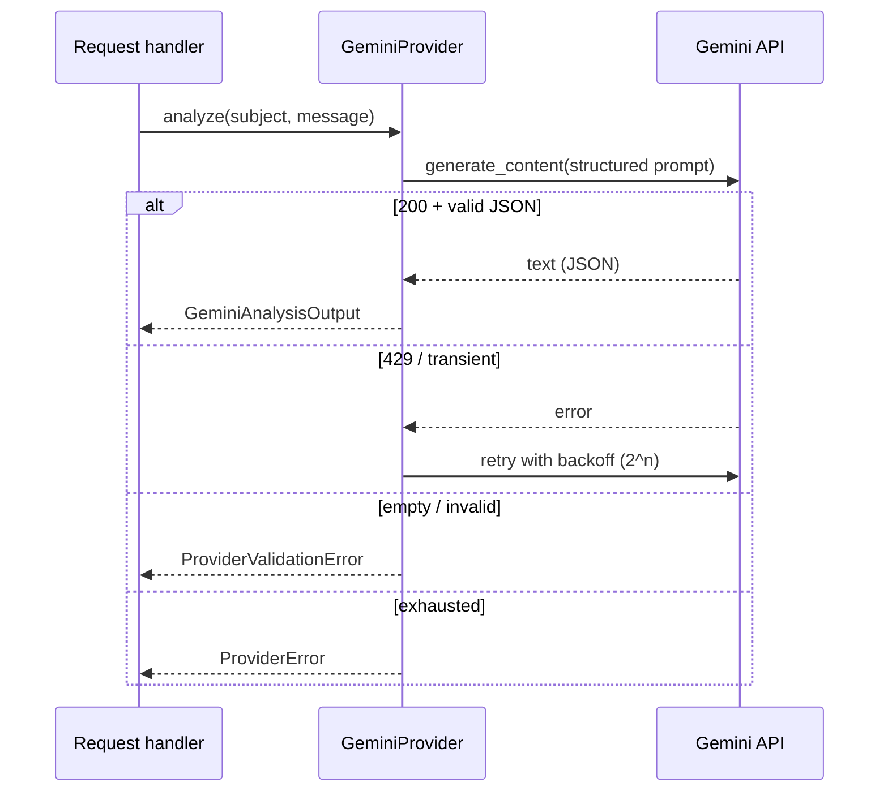

**Files:** `ai/gemini_provider.py`, `ai/prompts.py`, `ai/cache.py`,
`ai/exceptions.py`

---

## 11. Orchestration & the fallback matrix — never go dark

### Problem

The LLM **will** be unavailable sometimes. The service must still answer,
and consumers must know *which path produced the answer*.

### How we solve it

`GeminiPipeline` is the single decision point: try Gemini → catch typed
errors → fall back per-capability → annotate `warnings[]`.

### The fallback matrix

| Capability | Primary (Gemini) | Fallback | Warning |
|---|---|---|---|
| Classification | structured call | local TF-IDF classifier | `needs_review` if low confidence |
| Sentiment | label+score | `SentimentResult(available=False)` | `gemini_*` error tag |
| Social engineering | technique taxonomy | deterministic analyzers only | `gemini_*` error tag |
| Summary | abstractive | extractive summarizer | `summary_mode=extractive` |

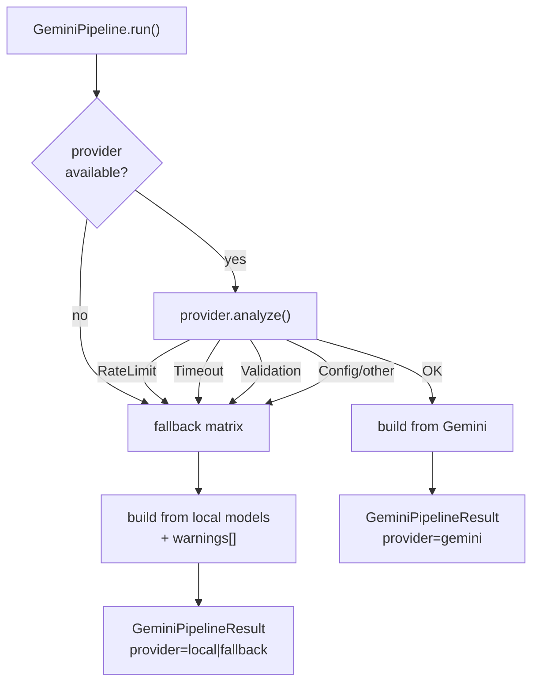

**Invariant:** `run()` **never raises**. Every caller gets a fully populated
result; `provider` + `warnings` carry the provenance story.

**Files:** `orchestration/pipeline.py`

---

## 12. API surface — the contract

FastAPI app with all subsystems exposed; the canonical outputs are what the
Backend consumes.

### Key endpoints

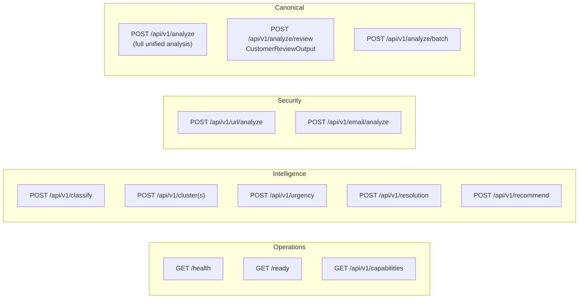

### The canonical output (abridged)

`CustomerReviewOutput` — every field the Backend persists:

```
review_id · source · content · classification(category, fine_grained_intent,
confidence, needs_review) · sentiment(label, score) · keywords · summary ·
clustering(cluster_id, cluster_name, similarity) · urgency(level, score,
reasons) · resolution(status, confidence, evidence) · security(risk_level,
phishing, urls, emails, social_engineering, reasons) · overall_risk ·
recommendation(primary_action, priority, secondary_actions, rationale) ·
model_metadata · processing(processed_at, time_ms, warnings)
```

**Files:** `api/routes.py`, `api/schemas.py`

---

## 13. Model lifecycle & QA — trained once, served honestly

### Problem

Models drift, metrics lie, and leaked labels make offline scores meaningless.

### How we solve it

A model registry + training scripts + a dedicated QA test suite.

### How it works

1. **Train**: `scripts/train_classifier.py`, `scripts/train_clusterer.py`
   read the cleaned dataset, split safely, persist joblib artifacts +
   metadata into `models/`.
2. **Register**: `config/model_registry.yaml` records name, version,
   training dataset, date, framework, **metrics** (e.g. val macro/weighted
   F1), and status (`production`).
3. **Serve**: `core/model_registry.py` + startup wiring load the artifact
   flagged `production`; `/api/v1/models` lists what's live.
4. **QA**: `tests/qa/` asserts leakage-free preprocessing, benchmarks QA
   behavior (`scripts/qa_benchmarks.py`), and evaluates periodically
   (`scripts/evaluate.py`, `scripts/profile_dataset.py`).

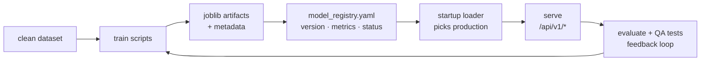

**Files:** `scripts/`, `config/model_registry.yaml`, `core/model_registry.py`,
`tests/qa/`

---

## 14. Ops & deployment — boring on purpose

- **Health/readiness**: `/health` (liveness) and `/ready` (models loaded) —
  wired into Docker `HEALTHCHECK`.
- **Observability**: structured per-request logs with request IDs and
  latency (`request_completed` events); provider warnings surfaced in
  responses, not just logs.
- **Config**: `core/config.py` — everything env-driven; secrets never logged.
- **Containers**: `Dockerfile` (non-root, models baked in, healthcheck) →
  compose / Cloud Run (see `/deploy/README-gcp.md`).
- **Graceful degradation**: the service starts even with AI disabled
  (`GEMINI_ENABLED=false`) — full local capability.

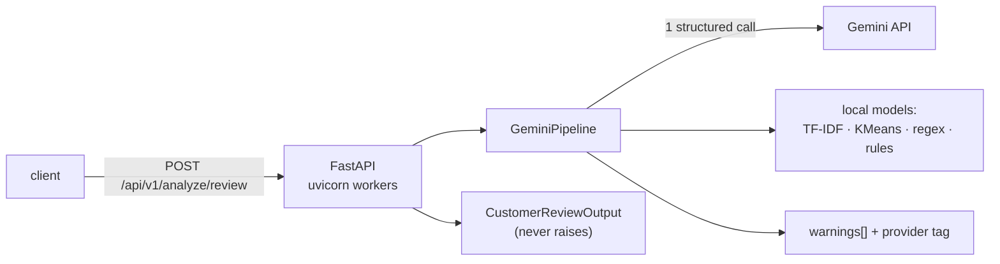

---

## 15. Cheat sheet — problem → mechanism → file

| # | Problem | Mechanism | File |
|---|---|---|---|
| 1 | Dirty text, leakage | canonical cleaner, dedupe, subject+message only | `preprocessing/cleaner.py` |
| 2 | Auto-routing, uncertainty | TF-IDF+LogReg, abstain < 0.60 | `classification/classifier.py` |
| 3 | Unknown emerging issues | MiniBatchKMeans k=15 | `clustering/clusterer.py` |
| 4 | Feeling + provenance | Gemini structured sentiment, `available` flag | `sentiment/analyzer.py` |
| 5 | Priority queue order | tiered operational-risk regexes | `urgency/detector.py` |
| 6 | Hidden resolution state | pattern state machine | `resolution/detector.py` |
| 7 | 10-second reads | entities + abstractive/extractive dual mode | `summarization/summarizer.py` |
| 8 | Phishing URLs/emails | deterministic analyzers + LLM fusion | `security/*_analyzer.py` |
| 9 | Consistent next action | declarative YAML rules, priority-ordered | `recommendation/engine.py` |
| 10 | LLM failure modes | retries, validation, typed errors | `ai/gemini_provider.py` |
| 11 | Never go dark | fallback matrix + warnings | `orchestration/pipeline.py` |
| 12 | Consumer contract | canonical 15-section schema | `api/schemas.py` |
| 13 | Model trust | registry + QA/leakage tests | `core/model_registry.py`, `tests/qa/` |
| 14 | Operable at 3am | health, logs, env config, containers | `main.py`, `Dockerfile` |
