# ML Service Testing & Reliability Verification Plan

## Executive Testing Strategy

As Senior ML QA & Reliability Engineer, this testing plan defines the audit, stress-testing, adversarial evaluation, and quality gate strategy for the Customer Complaint Intelligence & Security ML Service (`app/ml_services`).

---

## 1. Scope & Architecture Under Audit

| Component | Target Artifacts | Validation Focus |
| :--- | :--- | :--- |
| **Data & Preprocessing** | `preprocessing/cleaner.py`, `preprocessing/dataset.py` | Data leakage prevention, text sanitization, unicode, boundary lengths, HTML/injection |
| **Primary Classifier** | `classification/classifier.py`, `models/complaint_classifier_v1.joblib` | 11 canonical categories, calibration curve, abstention/thresholds, ambiguous queries, edge cases |
| **Fine-Grained Intent Classifier** | `models/intent_classifier_v1.joblib`, `config/intent_category_mapping.yaml` | 65-intent confusion matrix, low-support/minority class performance |
| **Topic Clustering** | `clustering/clusterer.py`, `models/clusterer_v1.joblib` | Centroid distances, noise assignment, semantic grouping, silhouette/Davies-Bouldin |
| **Frequency Analytics** | `analytics/frequency.py` | Thread concurrency, zero-division, trend math, telemetry separation |
| **Urgency Engine** | `urgency/detector.py` | Objective risk vs anger bias, critical escalation, edge cases |
| **Resolution Tracking** | `resolution/detector.py` | Closure signals, partial milestones, unknown fallback |
| **Recommendation Engine** | `recommendation/engine.py`, `config/action_rules.yaml` | Rule precedence, fallback behavior, hallucination prevention |
| **Security Intelligence** | `security/url_analyzer.py`, `security/email_analyzer.py` | Typosquatting, shorteners, IP hosts, punycode, mock resilience |
| **Conversation Summarizer** | `summarization/summarizer.py` | Entity preservation, hallucination prevention, length limits |
| **Unified Master API** | `POST /api/v1/analyze` | Partial failure isolation, quarantine escalation, end-to-end integration |
| **Reliability & Security** | `Dockerfile`, logging, dependencies | PII redaction in logs, non-root user, model reuse, latency/concurrency, pip audit |

---

## 2. Test Execution Matrix

```mermaid
flowchart TD
    A[Test Pipeline] --> B[Data Pipeline & Leakage Audit]
    A --> C[Model Performance & Calibration]
    A --> D[Security & Adversarial Testing]
    A --> E[API Robustness & Reliability]
    A --> F[Performance & Concurrency]

    B --> B1[Empty / Huge / Unicode / HTML Input]
    B --> B2[Issue Column Leakage Verification]
    B --> B3[Split Overlap & Stratification Audit]

    C --> C1[11 Canonical Classes Verification]
    C --> C2[Ambiguous & Out-of-Distribution Cases]
    C --> C3[Intent Confusion Matrix & Class Imbalance]
    C --> C4[Cluster Cohesion & Centroid Distances]

    D --> D1[Prompt Injection Invariance]
    D --> D2[PII Log Redaction Audit]
    D --> D3[Malicious URL & Typosquatting Scanning]

    E --> E1[Boundary Status Codes 400/422/503]
    E --> E2[Model Failure / Missing Artifacts]
    E --> E3[Partial Failure Tolerance]

    F --> F1[Startup Time & Single Inference]
    F --> F2[Concurrent Load: 10, 50, 100 requests]
    F --> F3[Model Re-use & Memory Profile]
```

---

## 3. Detailed Verification Stages

### Stage 1: Baseline Test Suite Execution
- Execute current test suite with `pytest --cov`. Record total tests, passes, fails, and coverage metrics.

### Stage 2: Data Preprocessing & Leakage Audit
- Validate that `issue` column is never ingested during inference or training.
- Check intersection of hashes between `train.csv`, `val.csv`, and `test.csv`.
- Feed boundary inputs (0 bytes, 50k chars, HTML tags, emoji, zero-width spaces, special characters).

### Stage 3: Classification, Confidence & Abstention
- Evaluate model on representative realistic examples for all 11 business categories:
  - `PAYMENT_ISSUE`, `DELIVERY_PROBLEM`, `REFUND_REQUEST`, `ACCOUNT_ACCESS`, `SUBSCRIPTION_ISSUE`, `TECHNICAL_PROBLEM`, `SERVICE_QUALITY`, `BILLING_PROBLEM`, `SECURITY_CONCERN`, `PRODUCT_DEFECT`, `OTHER`.
- Evaluate ambiguous complaints (payment vs delivery, refund vs billing).
- Evaluate out-of-distribution complaints (cooking recipes, quantum mechanics, gibberish) to test abstention (`needs_review: true`).

### Stage 4: Fine-Grained Intents & Class Imbalance
- Compute per-class precision, recall, F1, and support on test split.
- Identify top confused intent pairs and minority class vulnerabilities.

### Stage 5: Topic Clustering & Quality
- Compute unsupervised clustering metrics: Silhouette Score, Davies-Bouldin Index.
- Test semantic proximity of near-paraphrase complaints versus unrelated topics.

### Stage 6: Urgency, Resolution & Action Recommendations
- Verify sentiment/anger does not spuriously trigger `CRITICAL` urgency.
- Verify resolution states (`RESOLVED`, `UNRESOLVED`, `PARTIALLY_RESOLVED`, `UNKNOWN`).
- Verify action rules strictly follow `config/action_rules.yaml`.

### Stage 7: Security Intelligence & Adversarial Inputs
- Test URL analysis with IP addresses, shorteners, punycode homographs, and credential paths.
- Test email typosquatting against major brands (`amaz0n`, `g00gle`, `paypa1`) and disposable providers.
- Test prompt injection attempts to ensure customer text is treated as passive data.

### Stage 8: PII & Privacy Logging Audit
- Inject simulated PII (PAN cards, credit cards, emails, phone numbers, auth tokens).
- Capture log stream and assert sensitive strings are redacted or absent.

### Stage 9: API Robustness, Error Handling & Model Failures
- Audit HTTP status codes across all endpoints.
- Test missing model artifacts and assert graceful HTTP 503 response.
- Verify partial failure isolation in `POST /api/v1/analyze`.

### Stage 10: Performance, Model Loading & Concurrency
- Benchmark latency: single request, 10 concurrent, 50 concurrent, 100 concurrent.
- Verify models are loaded only once on startup and reused across requests.

### Stage 11: Docker, Dependencies & CI Alignment
- Verify container build, non-root user execution, and health check.
- Check dependency vulnerabilities with `pip-audit` or safety checks.
- Audit CI workflow (`ruff format --check .`, `ruff check .`, `mypy`).

---

## 4. Deliverables
1. `reports/ml_testing_plan.md` (This document)
2. `tests/fixtures/ml_regression_cases.json` (Permanent regression dataset)
3. `reports/model_quality_gate.json` (Machine-readable quality gate)
4. Comprehensive QA test modules in `tests/qa/`
5. `reports/ml_test_report.md` & `reports/ml_test_report.json`
