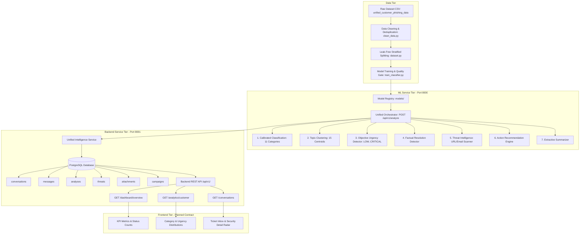

# Integration Architecture & System Overview

## 1. High-Level Architecture

The Customer Complaint ML & Security Intelligence Platform (`Solwin`) is structured as a modular, dataset-driven intelligence system integrating data preprocessing, ML/security analytics, persistent backend services, and dashboard visualization.

---

## 2. Component Boundaries & Responsibilities

### Team A: ML Service (`app/ml_services`)
- **Port**: `8000`
- **Ownership**:
  - Model weights, feature extraction pipelines, vocabulary dictionaries.
  - Zero-leakage inference engine.
  - Objective urgency scoring and factual resolution detection.
  - URL and email threat intelligence scanning.
  - Priority-ordered deterministic action recommendation.
  - Extractive summarization with zero hallucination.
  - Serves canonical API: `POST /api/v1/analyze`.

### Team B: Backend Service (`app/Backend`)
- **Port**: `8001`
- **Ownership**:
  - Relational schema management (SQLAlchemy ORM + Alembic).
  - Conversation lifecycle and message persistence.
  - Strict MIME validation and secure filesystem attachment storage.
  - Automated threat campaign correlation across shared indicators.
  - Analytical aggregation queries for dashboard rendering.
  - Client authentication and role-based access control (`RBAC`).

### Team C: Data Engineering (`app/data`)
- **Ownership**:
  - Source raw dataset preservation (`unified_customer_phishing_data (1).csv`).
  - Automated data cleaning, whitespace normalization, and deduplication (`clean_data.py`).
  - Automated database seeding (`seed.py`).

### Team D: Frontend Contract (`app/frontend`)
- **Status**: Absent in current checkout (`.gitkeep`).
- **Integration**: Fully specified in `docs/api-contract.md` to consume Backend REST endpoints without modification.
